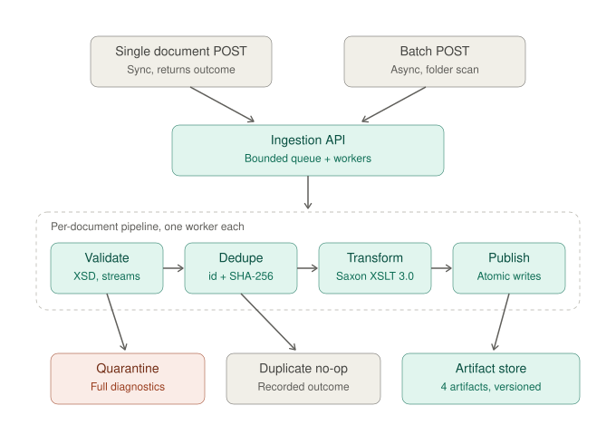

# Architecture: Legal Content Transformation Service

Assignment: LexisNexis French Content Systems, OfferZen tech vetting (Robin Christian brief).
Owner, reviewer, and sole committer: Katli.

---

## 1. Framing sentence (use everywhere: SOLUTION.md, video, interview)

LexisNexis' product moat is trusted, citable legal content feeding RAG systems (Lexis+ with Protege). Retrieval quality is bounded by corpus quality. This service is the point where trusted content is manufactured: validate at the gate, normalize deterministically, publish idempotently, and emit artifacts shaped for retrieval (paragraph-level citation anchors plus typed metadata), not just converted files.

## 2. System diagram



The committed diagram is `docs/architecture.svg` (self-contained, renders identically on GitHub in light and dark mode). Reading order: two entry points converge on one API, every document flows through the identical four-stage pipeline (the "one code path, one set of metrics" argument in a picture), and the three exits carry the design story: teal happy path into the versioned artifact store, coral trust gate into quarantine with diagnostics, gray idempotent no-op. Not drawn, deliberately: Actuator/Micrometer observing every stage, and env-var config feeding the queue and worker count.

## 3. Locked decisions and their one-line defenses

| # | Decision | Defense |
|---|----------|---------|
| 1 | Java 21 LTS, Spring Boot 3.x, Maven | Brief specifies 17+ and Boot 3.x; 21 is the current LTS inside that constraint. Virtual threads available for the worker pool story. |
| 2 | Validate with JDK `javax.xml.validation` (Xerces), transform with Saxon-HE | Saxon-HE has no XSD validation (EE feature). Right tool per concern, zero licence cost. |
| 3 | XSLT 3.0 stylesheet builds the W3C JSON vocabulary, then `xml-to-json()` | Inspectable intermediate, defensible line by line. Saxon docs confirm xml-to-json in all editions since 9.7. |
| 4 | Stylesheet compiled once at startup (`XsltExecutable`), new `XsltTransformer` per document | XsltExecutable is thread-safe and immutable; transformers are not. Same for Schema vs Validator. |
| 5 | Idempotency = content_id + SHA-256 of received bytes | Exact resubmission is a recorded no-op; same id with new hash publishes version N+1 with an audit trail (supersession). Mirrors real feeds: corrections and GDPR re-anonymization re-deliver the same decision. Trade-off stated in SOLUTION.md: byte hashing means a whitespace-only change is a new version; XML canonicalization (C14N) before hashing is the refinement, deliberately deferred. |
| 6 | Invalid docs quarantined with full diagnostics (all cvc errors, line/col), never published | Validation is a trust gate: one bad document in the corpus becomes a wrong answer with a citation attached. |
| 7 | Filesystem artifact store + in-memory status registry | Right-sized for the brief; the cloud answer (S3 + DynamoDB conditional writes) lives in SOLUTION.md. |
| 8 | Bounded queue + fixed worker pool, size from env var; big-document posture: validation streams (SAX), identity via StAX, only the transform builds a tree | Backpressure instead of OOM; memory flat over batch size and near-flat over document size. See section 10. |
| 9 | Third artifact: `chunks.jsonl`, one self-contained record per paragraph | The artifact an embedding pipeline actually ingests. Directly answers Task 3's RAG question and is the design move aimed at their business. |
| 10 | Cloud chapter targets AWS | S3 in/out, SQS trigger, EKS compute, DynamoDB dedupe, CloudWatch + Micrometer. Backed by real Sedna experience. |

## 4. API surface

```
POST /api/v1/documents            body: XML            -> 200 { contentId, outcome, version?, links } (synchronous; 400 problem+json if unparseable)
POST /api/v1/batches              body: { inputDir }   -> 202 { batchId, discovered, status } (async)
GET  /api/v1/documents/{contentId}                     -> status, versions, artifact links, diagnostics if quarantined
GET  /api/v1/documents/{contentId}/artifacts/{kind}    -> normalized | fulltext | chunks
GET  /api/v1/batches/{batchId}                         -> counts: queued/processing/published/duplicate/quarantined, durations
GET  /actuator/health | /actuator/metrics | /actuator/prometheus
```

Notes:
- Single POST runs the pipeline synchronously on the request thread and returns the outcome; batch is async with polling. Both funnel into the identical per-document pipeline: one code path, one set of metrics.
- content_id is only knowable AFTER parsing begins; for malformed XML that never parses, quarantine under a generated ingest id.

## 5. Artifact store layout

```
${OUTPUT_DIR}/
  published/{content_id}/
    manifest.json          # versions[], each: version, sha256, publishedAt, supersededBy?
    v{N}/normalized.json
    v{N}/fulltext.txt
    v{N}/chunks.jsonl
  quarantine/{ingest_id}/
    original.xml
    diagnostics.json       # [{line, col, code, message}], receivedAt, sourceName
```

chunks.jsonl record shape (one line per paragraph):

```json
{"chunk_id":"FR-2024-CA-000123#p2","content_id":"FR-2024-CA-000123","paragraph_id":"p2","section":"reasons","seq":2,"text":"Considérant que...","court":"Cour d'appel de Paris","jurisdiction":"FR","decision_date":"2024-03-12","citations":[{"type":"ECLI","value":"ECLI:FR:CA12345"}],"version":1}
```

Why: pinpoint citation anchors (chunk_id), retrieval filters (jurisdiction/date/court), section-aware weighting (reasons vs disposition), graph edges (typed citations). Each record is self-contained so the embedding job needs no joins.

## 6. Module boundaries (packages)

```
io.github.katlego95.lexpipeline
  api/          controllers, request/response DTOs, error model (RFC 7807 problem+json)
  pipeline/     DocumentPipeline orchestrator (validate -> dedupe -> transform -> publish)
  validation/   XsdValidationService (Schema singleton, Validator per doc, error collector)
  transform/    XsltTransformService (XsltExecutable singleton, transformer per doc)
  identity/     ContentIdentity (content_id extraction + SHA-256)
  store/        ArtifactStore (atomic writes: temp file + move), ManifestRepository
  batch/        BatchService (folder scan, bounded submission), JobRegistry
  config/       @ConfigurationProperties: paths, concurrency, xslt/xsd locations
  observability/ Micrometer counters/timers, structured logging
```

Error model: every failure is a recorded outcome, not an exception escaping. Categories: MALFORMED_XML, SCHEMA_INVALID, TRANSFORM_FAILED, STORAGE_FAILED, DUPLICATE_NOOP, SUPERSEDED.

## 7. Configuration (all via env, Docker-friendly)

```
APP_INPUT_DIR, APP_OUTPUT_DIR, APP_CONCURRENCY (worker count), APP_QUEUE_CAPACITY,
APP_XSD_PATH, APP_XSLT_PATH, APP_MAX_DOC_BYTES (oversize guard), SERVER_PORT
```

## 8. Metrics that matter (Micrometer)

- documents_received_total, documents_published_total, documents_quarantined_total, documents_duplicate_total, documents_superseded_total
- pipeline_stage_duration_seconds{stage=validate|transform|publish} (timers)
- queue_depth gauge, active_workers gauge

## 9. Cloud evolution (SOLUTION.md skeleton, written in Katli's AWS vocabulary)

- Inputs: S3 landing bucket; event notification -> SQS; service consumes SQS (replaces the folder scan; the batch endpoint becomes a backfill tool).
- Compute: container on EKS, HPA on queue depth; concurrency stays an env var.
- Dedupe/versioning at scale: DynamoDB table keyed by content_id, conditional write on sha256 (the manifest.json becomes a DynamoDB item). Idempotent consumers tolerate SQS at-least-once delivery.
- Outputs: S3 published bucket, prefix per content_id/version; quarantine prefix with diagnostics.
- Monitoring: Micrometer -> Prometheus/CloudWatch, alarms on quarantine rate and queue age; structured JSON logs.
- RAG evolution: chunks.jsonl -> embedding job (Step Functions or a consumer) -> vector store (OpenSearch); typed citations -> graph edges (their Shepard's/GraphRAG pattern); jurisdiction/date as retrieval filters.

## 10. Big-document memory posture (answers the brief's "works well when documents get big")

Per stage, what is in memory:
- **Size guard first:** APP_MAX_DOC_BYTES rejects pathological input to quarantine (OVERSIZE) before any parsing. Noisy-input defence together with XXE hardening.
- **Validation:** `Validator.validate(new StreamSource(...))` is SAX-driven; it streams and never builds a tree. Memory is O(1) in document size.
- **Identity:** StAX pull reader extracts content_id and stops after the header; SHA-256 is computed over a streamed digest. O(1).
- **Transform:** the one stage that must materialise the document. Saxon builds a TinyTree (significantly more compact than DOM). True streaming XSLT (`xsl:mode streamable`) is a Saxon-EE feature, so with HE the honest ceiling is one TinyTree per active worker: peak memory ≈ concurrency × largest document, which the size cap and the worker count bound explicitly. State this ceiling in SOLUTION.md; the evolutions if documents outgrow it are Saxon-EE streaming or splitting upstream.
- **Batch:** files are discovered lazily and submitted to a bounded queue; no stage ever holds a list of parsed documents.

## 11. Test strategy

- Unit: XSLT tested as a unit (sample XML in, JSON assertion out, using JSONAssert); validator diagnostics; identity/hash.
- Integration: MockMvc/full-context tests through the REST API: happy path, invalid date, duplicate p-id, resubmission no-op, changed-content supersession, batch of N with concurrency > 1.
- One memory-sanity note in SOLUTION.md: per-document streaming, bounded queue, measured with a large generated batch.
